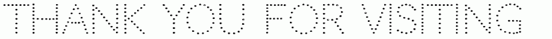

<!-- Ajay S Vasan | Self-contained Animated README -->

  

<h1 align="center">👋 Hey there, I'm <b>Ajay S Vasan</b></h1>
<h3 align="center">🚀 AI/ML Engineer | 🧠 Deep Learning Enthusiast | 💻 Full-Stack Developer | 🏁 Competitive Programmer</h3>

---

## 🧭 About Me
I’m pursuing **B.Tech in Artificial Intelligence and Machine Learning (2023–2027)** at **St. Joseph’s College of Engineering**.  
I love building **scalable, intelligent systems** — from healthcare AI to automation — and exploring how things work under the hood.

> “I believe in merging data, creativity, and engineering to build AI that truly matters.”

---

## 🔍 Core Focus Areas
- 🧠 Deep Learning (CNNs | Transformers | GANs)  
- ♻️ Reinforcement Learning & Optimization  
- 🎨 Generative AI & LLM Fine-tuning  
- ⚙️ System Design & Model Deployment  
- ⚡ Model Compression & Inference Optimization  

---

## 💻 Tech Stack

**Languages**  
`Python`  •  `C++`  •  `C`  •  `JavaScript`  •  `TypeScript`

**Frameworks & Libraries**  
`TensorFlow`  •  `PyTorch`  •  `OpenCV`  •  `Scikit-learn`  •  `FastAPI`  •  `Node.js`  •  `Express.js`  •  `React`

**Domains**  
NLP  •  Computer Vision  •  Reinforcement Learning  •  Generative AI  •  LLMs  

**Additional Skills**  
REST APIs  •  Data Preprocessing  •  Model Deployment  •  System Design  

---

## 🧠 Currently Learning
- Advanced Reinforcement Learning (custom environments)  
- Distributed AI Training (Ray / PyTorch Lightning)  
- Full-stack architecture (React + Node + FastAPI)  
- AI Agent Design (voice + vision + actions)

---

## 🚧 Upcoming Projects
- **AI Personal Assistant** (Voice + Vision + Actions)  
- **Virtual RL Sandbox** (Secure RL Execution)  
- **Discord + Codeforces Mashup** with AI Detection  
- **LLM Fine-tuning Pipeline** for Domain Tasks  

---

## 🔬 Selected Projects
- 🕵️‍♂️ **Deepfake Detection System** — CNN + Attention Model (>95 %)  
- 🎥 **Smart Security Camera** — YOLOv5 + OpenCV real-time alerts  
- 💬 **Medical Chatbot** — Transformer-based symptom assistant  
- ❤️ **Heart Disease Prediction** — Random Forest analytics  
- 💾 **Student Database (C++)** — Doubly-linked list DBMS (no SQL)  

---

## 🏆 Achievements
🥇 Winner — ProjectFest (AI/ML Innovation)  
🏆 Top Rank — IEEE Software Competition, Sairam College  
💡 Participant — IBM Datathon (Shooting Star Foundation)  
🎯 Participant — AIML Challenge 2 (IIT Madras)

---

## 📊 GitHub Stats
| 🔥 Streak | 🧠 Stats | 📚 Languages |
|:---:|:---:|:---:|
|  |  |  |

---

## 🤝 Let’s Connect
📧 [ajay192006@gmail.com](mailto:ajay192006@gmail.com)  
🔗 [LinkedIn](https://linkedin.com/in/ajay-s-vasan-584111291)  
💻 [GitHub](https://github.com/Ajaysvasan)

---

  

  <b>⚡ End of README — Keep Innovating!</b>

